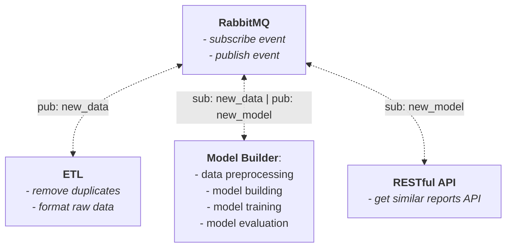

# 🪲 BuggyBuddy

BuggyBuddy is an end-to-end data science project aimed at performing similarity search through a bug report database to assist users in identifying duplicate bug reports. This facilitates faster problem resolution in software development.

In the BuggyBuddy project, there are two main components: Data Analysis and Model Exploration, and Production Microservices.

## 1. Data Analysis and Model Exploration

### a. BuggyBuddy-Notebook

This section contains in-depth data analysis and model exploration involving NLP techniques such as Embedding, Deep Learning, and Semantic Search.

[[BuggyBuddy-Notebook repository](https://github.com/uknow19/BuggyBuddy-Notebook)]

## 2. Production Microservices

The production microservices consist of three microservices: ETL, Model Builder, and RESTful API. These microservices communicate with each other using the RabbitMQ message broker through the publish-subscribe (pub/sub) mechanism, as illustrated in the diagram below:

### a. BuggyBuddy-ETL-Microservice
An ETL microservice built for seamless ETL pipeline, responsible for extracting, transforming, and loading bug report data.

[[BuggyBuddy-ETL-Microservice repository](https://github.com/uknow19/BuggyBuddy-ETL-Microservice)]

### b. BuggyBuddy-Model-Builder-Microservice
A Model Builder microservice designed to automatically create, train, evaluate, and save new models when new data is available (Triggered by an event/message of `new_data` published by the ETL Microservice).

[[BuggyBuddy-Model-Builder-Microservice repository](https://github.com/uknow19/BuggyBuddy-Model-Builder-Microservice)]

### c. BuggyBuddy-RESTful-API-Microservice
A RESTful API application for the BuggyBuddy project developed using FastAPI. This microservice serves as the interface for users to interact with the model created by the Model Builder Microservice to perform similarity searches on bug reports. The model update is triggered by an event/message of `new_model` published by the Model Builder Microservice.

[[BuggyBuddy-RESTful-API-Microservice repository](https://github.com/uknow19/BuggyBuddy-RESTful-API-Microservice)]